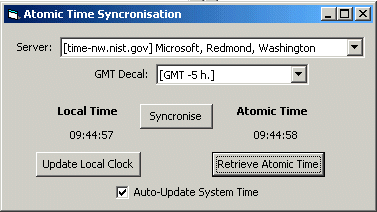



## Atomic Time Syncronisation \(Updated\)

### Description

This is a simple Atomic Time Syncronisation application. It allows you to syncronise Local System Clock with Atomic Clocks around the USA. You choose your server, select your regional GMT decal and then you can easily do syncronization. Note: there may be one or two seconds delay from the real time but this is not important since the system clock is rapidly desyncronizing by itself.

See http://www.boulder.nist.gov/timefreq/service/its.htm for more information on Atomic Time.

Now with high precision syncronisation.
 
### More Info
 

             |
---                |---
**Submitted On**   |2001-03-05 10:00:32
**By**             |[Vincent Bouret](https://github.com/Planet-Source-Code/PSCIndex/blob/master/ByAuthor/vincent-bouret.md)
**Level**          |Beginner
**User Rating**    |4.7 (33 globes from 7 users)
**Compatibility**  |VB 5\.0, VB 6\.0
**Category**       |[Complete Applications](https://github.com/Planet-Source-Code/PSCIndex/blob/master/ByCategory/complete-applications__1-27.md)
**World**          |[Visual Basic](https://github.com/Planet-Source-Code/PSCIndex/blob/master/ByWorld/visual-basic.md)
**Archive File**   |[CODE\_UPLOAD15990352001\.zip](https://github.com/Planet-Source-Code/vincent-bouret-atomic-time-syncronisation-updated__1-21525/archive/master.zip)

